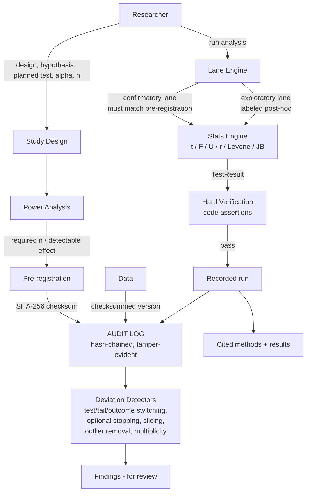

<p align="center">
  
</p>

<h1 align="center">ResLab</h1>

<p align="center">
  <b>The lab notebook that keeps science honest.</b><br/>
  Design → pre-register → analyze → verify → detect.<br/>
  Real statistics, hard verification, tamper-evident provenance — no hallucinations.
</p>

<p align="center">
  <a href="https://github.com/thesithunyein/reslab/actions"></a>
  <a href="LICENSE"></a>
  
  
  
  
  
</p>

---

## The problem

The reproducibility crisis is the defining problem in research today: p-hacking,
HARKing, and post-hoc test-switching quietly corrupt a large share of published
findings. Most "AI for data" tools make it *worse* — they answer anything with
confidence and never check whether the analysis was even appropriate.

ResLab is the opposite. It treats research integrity as **infrastructure**:

- **Every statistic is computed, not generated.** t-tests, Welch, paired t,
  ANOVA, Pearson, Mann-Whitney, Levene, Jarque-Bera, power analysis — real
  math, verified against known values before they can enter the record.
- **Every result is hard-verified.** A result cannot be written to the audit
  log unless it passes code assertions (finite, in-range, correct df, valid n).
- **Every action is recorded in a tamper-evident, hash-chained audit log.**
  Any silent edit breaks the chain, and the break is visible.
- **Confirmatory and exploratory analyses are separated lanes.**
  Claims come only from the pre-registered lane; post-hoc exploration is
  allowed but labeled — it generates hypotheses, never conclusions.
- **A deviation-detector suite catches p-hacking patterns**: test switching,
  tail switching, outcome switching, optional stopping, subgroup slicing,
  undeclared outlier removal, uncorrected multiple comparisons.

> **Guardian, not police.** Deviations are flagged *for review* — the human
> always decides. But the deviation is now visible, versioned, and auditable.

## What's computed vs. what's generated

| Thing | How | 
|---|---|
| p-values, t/F/U/r statistics, effect sizes, power | **Computed** by the stats engine, verified by code assertions |
| Pre-registration checksum | **SHA-256** over the canonical design |
| Audit chain | **SHA-256** hash-chained events |
| Integrity findings | **Deterministic rule engine** over the audit log + runs |
| Any written claim | Grounded in the *actual computed numbers* from the log |

No LLM computes a number. No number enters the record unverified.

## Architecture



## Repository layout

```
reslab/
├─ assets/logo.png              # brand mark
├─ packages/core/
│  ├─ src/
│  │  ├─ special-functions.ts   # erf, normal, gamma, incomplete beta (verified)
│  │  ├─ stats.ts               # t/Welch/paired/ANOVA/Pearson/Mann-Whitney/
│  │  │                         #   Levene/Jarque-Bera + power analysis
│  │  ├─ verify.ts              # hard verification (no NaN/out-of-range ever)
│  │  ├─ audit.ts               # hash-chained, tamper-evident audit log
│  │  ├─ power.ts               # design-phase power analysis
│  │  ├─ prereg.ts              # pre-registration design, lock, checksum, versioning
│  │  ├─ lanes.ts               # confirmatory/exploratory lane enforcement
│  │  └─ detectors.ts           # p-hacking / HARKing deviation detectors
│  ├─ test/                     # 78 tests, all green
│  └─ examples/honest-flow.ts   # end-to-end demo (npm run demo)
├─ site/                        # product site (static, dark isometric branding)
│  └─ index.html                 #   deployed to reslab.sithunyein.com
└─ .github/workflows/ci.yml     # typecheck + tests on every push
   .github/workflows/deploy.yml # Cloudflare Pages deploy for site/
```

## Live site

The product site lives at **reslab.sithunyein.com** — the dark, isometric-branded
front door with the real honest-flow demo output embedded.

## Quick start

```bash
npm install
npm test          # 78 tests, all green
npm run demo      # end-to-end honest-flow demo with deterministic data
npm run build     # emit dist/
```

The demo (`npm run demo`) runs the full flow on deterministic seeded data:

```
1. DESIGN           spaced repetition vs. massed practice, planned welch_t, n=63/group
2. PRE-REGISTRATION locked with SHA-256 checksum
3. DATA COLLECTED   n=40/group (fewer than planned - power warning fires)
4. CONFIRMATORY     t = -4.6896  df = 76.31  p = 1.176e-5   verification PASSED
5. EXPLORATORY      post-hoc Mann-Whitney, labeled, walled off
6. DETECTORS        [MEDIUM] sample smaller than planned yet significant
7. PROVENANCE       audit chain INTACT, reproducibility recipe hashed
```

## Correctness: why you can trust the numbers

The stats engine is not "vibe-checked" — it is **validated against known values**:

- **t-tables**: `t(10, two-sided, α=0.05) = 2.228`, `t(20) = 2.086` → p ≈ 0.05
- **F-tables**: `F(2,27, 0.95) = 3.354` → p ≈ 0.05
- **Chi-square tables**: `χ²(2, 0.95) = 5.991` → CDF ≈ 0.95
- **R's sleep dataset**: pooled t = −1.8608 (df 18, p = 0.0792),
  Welch df = 17.776 (p = 0.0794), paired t = −4.0621 (df 9, p = 0.002833)
- **R's PlantGrowth**: ANOVA F = 4.846 (df 2,27, p = 0.0159), η² = 0.264
- **Anscombe's quartet I**: r = 0.81642, t = 4.2415, p = 0.00217
- **Mann-Whitney exact**: fully separated n₁=n₂=4 → U = 0, p = 2/70 exactly
- Cross-checked against **numpy/scipy reference implementations**

Special functions follow **Numerical Recipes (Press et al.)** and
**Abramowitz & Stegun** (erf 7.1.26, inverse normal via Acklam's rational
approximation, Lanczos ln Γ, continued-fraction incomplete beta).

## Design decisions (and why)

- **Client-side computation.** Statistics run where the data lives — zero
  server cost, instant results, and a privacy story ("your data never leaves
  your machine except the interpretation step"). The only network call is the
  LLM interpretation, routed through a worker that keeps the API key secret.
- **Guided, not autonomous.** The agent never executes arbitrary code. It
  calls a curated, tested analysis library with chosen parameters — the
  difference between "advanced" and "breaks live on stage."
- **Guardian framing.** Detection is "for review," never forbidden. That is
  both the ethically correct design and the one that survives false positives.

## Roadmap

- [x] Stats engine + hard verification (validated against scipy/R references)
- [x] Pre-registration with tamper-evident locking and versioning
- [x] Confirmatory/exploratory lane enforcement
- [x] P-hacking deviation detectors
- [x] Hash-chained audit log + reproducibility recipe
- [x] End-to-end honest-flow demo
- [ ] Web UI (Vite SPA) + Featherless-backed interpretation layer
- [ ] Live site at reslab.sithunyein.com (Cloudflare)
- [ ] Exportable Markdown/PDF research report

## License

MIT — see [LICENSE](LICENSE).

---

*Built for Impact Forge 2026. Every number in this repository is computed, verified, and reproducible.*
