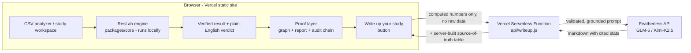
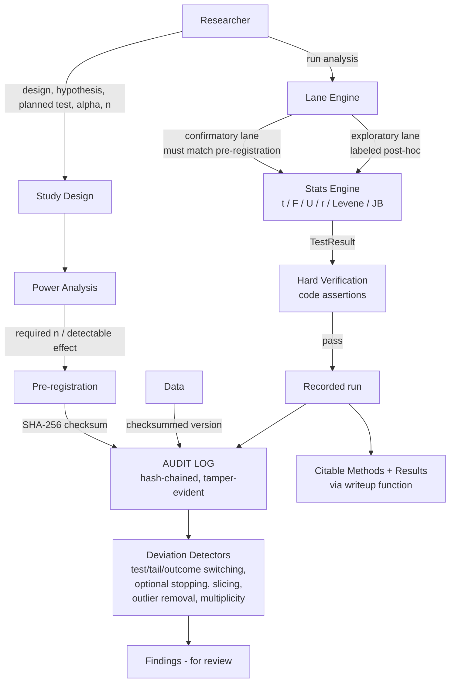

<p align="center">
  
</p>

<h1 align="center">ResLab</h1>

<p align="center">
  <b>The lab notebook that keeps science honest.</b><br/>
  Design → pre-register → analyze → verify → detect.<br/>
  Real statistics, hard verification, tamper-evident provenance, no hallucinations.
</p>

<p align="center">
  <a href="https://github.com/thesithunyein/reslab/actions"></a>
  <a href="LICENSE"></a>
  
  
  
  
  
</p>

---

## The problem

The reproducibility crisis is the defining problem in research today: p-hacking,
HARKing, and post-hoc test-switching quietly corrupt a large share of published
findings. Most "AI for data" tools make it *worse*: they answer anything with
confidence and never check whether the analysis was even appropriate.

ResLab is the opposite. It treats research integrity as **infrastructure**:

- **Every statistic is computed, not generated.** t-tests, Welch, paired t,
  ANOVA, Pearson, Mann-Whitney, Levene, Jarque-Bera, power analysis. Real
  math, verified against known values before they can enter the record.
- **Every result is hard-verified.** A result cannot be written to the audit
  log unless it passes code assertions (finite, in-range, correct df, valid n).
- **Every action is recorded in a tamper-evident, hash-chained audit log.**
  Any silent edit breaks the chain, and the break is visible.
- **Confirmatory and exploratory analyses are separated lanes.**
  Claims come only from the pre-registered lane; post-hoc exploration is
  allowed but labeled: it generates hypotheses, never conclusions.
- **A deviation-detector suite catches p-hacking patterns**: test switching,
  tail switching, outcome switching, optional stopping, subgroup slicing,
  undeclared outlier removal, uncorrected multiple comparisons.

> **Guardian, not police.** Deviations are flagged *for review*; the human
> always decides. But the deviation is now visible, versioned, and auditable.

## Who it's for

| Audience | What ResLab gives them |
|---|---|
| **Researchers & grad students** | Pre-register a plan, lock it with a checksum, run the confirmatory test, and get a citable, reproducible Methods + Results section |
| **Reviewers & auditors** | A hash-chained provenance trail that shows *exactly* which file, at which time, produced which number |
| **Data & analytics teams** | A plain-English verdict on any two-group comparison, with the full receipt attached |
| **Educators** | A concrete, honest demonstration of why pre-registration and verification matter |

## How it works

1. **Design**: state the hypothesis, the planned test, and the power target.
2. **Pre-register**: ResLab locks the plan with a real **SHA-256 checksum**
   before the data enters the picture. Edit the plan later and the lock breaks.
3. **Analyze**: run the pre-registered (or exploratory) test. Every number is
   computed by the engine and hard-verified before it can be recorded.
4. **Detect**: integrity detectors watch for p-hacking patterns and flag them
   *for review* (e.g. a significant result from a smaller-than-planned sample
   triggers an optional-stopping finding).
5. **Prove**: the audit chain shows every action; the raw data, its hash, and
   the report are downloadable so anyone can re-run the math themselves.

On the live site, **"Pre-registration workspace"** runs this whole flow in one
click: the engine executes it for real in your browser.

## What's computed vs. what's generated

| Thing | How |
|---|---|
| p-values, t/F/U/r statistics, effect sizes, power | **Computed** by the stats engine, verified by code assertions |
| Pre-registration checksum | **SHA-256** over the canonical design |
| Audit chain | **SHA-256** hash-chained events |
| Integrity findings | **Deterministic rule engine** over the audit log + runs |
| Written claims (Methods/Results) | **Grounded in the actual computed numbers**: an LLM writes prose, it never computes |

No LLM computes a number. No number enters the record unverified.

## Architecture

### Product topology



### Engine internals



## Project structure

```
reslab/
├─ api/
│  └─ writeup.js                # Vercel serverless function: grounded LLM writeup
├─ assets/
│  └─ logo.png                  # brand mark
├─ packages/core/               # the engine (npm workspace @reslab/core)
│  ├─ src/
│  │  ├─ special-functions.ts   # erf, normal, gamma, incomplete beta (verified)
│  │  ├─ stats.ts               # t / Welch / paired / ANOVA / Pearson /
│  │  │                         #   Mann-Whitney / Levene / Jarque-Bera + power
│  │  ├─ verify.ts              # hard verification (no NaN/out-of-range ever)
│  │  ├─ audit.ts               # hash-chained, tamper-evident audit log
│  │  ├─ power.ts               # design-phase power analysis
│  │  ├─ prereg.ts              # pre-registration lock, checksum, versioning
│  │  ├─ lanes.ts               # confirmatory / exploratory lane enforcement
│  │  ├─ detectors.ts           # p-hacking / HARKing deviation detectors
│  │  ├─ llm/                   # Featherless client + grounded report writer (CLI)
│  │  └─ index.ts               # public API surface
│  ├─ test/                     # 7 suites, 78 tests, all green
│  └─ examples/                 # honest-flow demo + report generator
├─ web/                         # product site (npm workspace @reslab/web)
│  ├─ src/
│  │  ├─ main.ts / styles.css   # app shell and design system
│  │  ├─ csv.ts / csv-parser.ts # CSV analyzer: plain-English verdict + receipt
│  │  ├─ proof.ts               # proof layer: graph, report, downloads, writeup
│  │  └─ study.ts               # pre-registration workspace (one-click flow)
│  ├─ public/                   # logo, hero/dashboard videos, CNAME
│  ├─ index.html
│  ├─ vite.config.ts            # docs/ for GitHub Pages, dist/ for Vercel
│  └─ package.json
├─ docs/                        # static build of the site (GitHub Pages fallback)
├─ local/                       # private working notes (submission, video script)
├─ .github/workflows/
│  ├─ ci.yml                    # typecheck + tests on every push
│  └─ deploy.yml                # optional Cloudflare Pages deploy (token-gated)
├─ vercel.json                  # Vercel build command + output directory
├─ tsconfig.base.json           # shared TypeScript config
└─ package.json                 # npm workspaces: packages/*, web
```

## Live site

The product site lives at **reslab.sithunyein.com** (production, HTTPS, hosted
on Vercel). Try the one-click sample dataset: you get a plain-English verdict,
the numbers behind it, the proof layer (interactive graph, structured report,
raw-data downloads, audit chain), and a grounded AI writeup: all from the real
engine running in your browser.

## Quick start

```bash
npm install
npm test          # 78 tests, all green
npm run typecheck # engine typecheck
npm run typecheck:web
npm run demo      # end-to-end honest-flow demo with deterministic data
npm run site      # build the product site
```

The demo (`npm run demo`) runs the full flow on deterministic seeded data:

```
1. DESIGN           spaced repetition vs. massed practice, planned welch_t, n=63/group
2. PRE-REGISTRATION locked with SHA-256 checksum
3. DATA COLLECTED   n=40/group (fewer than planned - power warning fires)
4. CONFIRMATORY     t = -4.6896  df = 76.31  p = 1.176e-5   verification PASSED
5. EXPLORATORY      post-hoc Mann-Whitney, labeled, walled off
6. DETECTORS        [MEDIUM] sample smaller than planned yet significant
7. PROVENANCE       audit chain INTACT, reproducibility recipe hashed
```

### Deploying

- **Vercel (production):** `vercel.json` already configures the build
  (`npm run site`, output `web/dist`). `api/writeup.js` deploys as a serverless
  function at `/api/writeup`.
- **Environment:** set `FEATHERLESS_API_KEY` in the Vercel project
  (Production). The key never reaches the client bundle.
- **GitHub Pages (fallback):** `npm run site` also emits `docs/`; the CNAME
  file keeps it domain-ready if you ever want the static mirror back.

## Security

- **Your data never leaves your machine.** Statistics run entirely in the
  browser. There is no upload, no server-side storage, no tracking.
- **The AI writeup sees summary numbers only.** The writeup call transmits
  computed statistics (means, SDs, n, t, df, p, effect size): never the raw
  data file and never individual observations.
- **Server-side key, validated inputs.** The `FEATHERLESS_API_KEY` lives only
  in the Vercel environment. The function validates every field (finite
  numbers, in-range p, sane sample sizes, bounded strings) before any request
  reaches the LLM, and the client is sandboxed to a strict grounded prompt.
- **Tamper-evidence by construction.** Pre-registration locks and the audit
  chain use SHA-256 hashes, so an undetected change is cryptographically
  infeasible, and any detected change breaks a visible chain.
- **No number is trusted at face value.** Every result passes hard code
  assertions (finite, in-range, correct df, valid n) before it can be recorded.

## Correctness: why you can trust the numbers

The stats engine is not "vibe-checked"; it is **validated against known values**:

- **t-tables**: `t(10, two-sided, α=0.05) = 2.228`, `t(20) = 2.086` → p ≈ 0.05
- **F-tables**: `F(2,27, 0.95) = 3.354` → p ≈ 0.05
- **Chi-square tables**: `χ²(2, 0.95) = 5.991` → CDF ≈ 0.95
- **R's sleep dataset**: pooled t = −1.8608 (df 18, p = 0.0792),
  Welch df = 17.776 (p = 0.0794), paired t = −4.0621 (df 9, p = 0.002833)
- **R's PlantGrowth**: ANOVA F = 4.846 (df 2,27, p = 0.0159), η² = 0.264
- **Anscombe's quartet I**: r = 0.81642, t = 4.2415, p = 0.00217
- **Mann-Whitney exact**: fully separated n₁=n₂=4 → U = 0, p = 2/70 exactly
- Cross-checked against **numpy/scipy reference implementations**

Special functions follow **Numerical Recipes (Press et al.)** and
**Abramowitz & Stegun** (erf 7.1.26, inverse normal via Acklam's rational
approximation, Lanczos ln Γ, continued-fraction incomplete beta).

## Design decisions (and why)

- **Client-side computation.** Statistics run where the data lives: zero
  server cost, instant results, and the strongest privacy story ("your data
  never leaves your machine"). The only network call is the grounded writeup,
  routed through a serverless function that keeps the API key secret.
- **Guided, not autonomous.** The agent never executes arbitrary code. It
  calls a curated, tested analysis library with chosen parameters: the
  difference between "advanced" and "breaks live on stage."
- **Guardian framing.** Detection is "for review," never forbidden. That is
  both the ethically correct design and the one that survives false positives.
- **Proof is attached to claims.** Every result ships with its raw data,
  its SHA-256 hash, and its audit chain: a summary without its receipt is
  just a claim.

## Roadmap

| Milestone | Status | Scope |
| --- | --- | --- |
| **v0.1 · Honest core** | ✅ Shipped | Verified stats engine, pre-registration locking, confirmatory/exploratory lanes, p-hacking detectors, hash-chained audit log |
| **v0.2 · Product** | ✅ Shipped | Web UI with in-browser analyzer, proof layer (graph + report + raw data), live site, Featherless-grounded writeup |
| **v0.3 · Breadth** | 🚧 In progress | ANOVA, correlation, paired t, chi-square in the analyzer UI; exportable Markdown/PDF report |
| **v0.4 · Multi-user** | 🧭 Planned | User-driven pre-registration, saved studies, accounts |

## License

MIT. See [LICENSE](LICENSE).

---

*Every number in this repository is computed, verified, and reproducible.*
